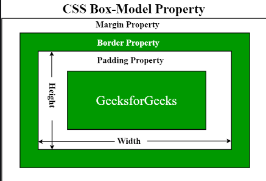

# HTML Introduction

HTML describe webpage structure with tags marking the documents appropriately to tell the browser what each tagged element is.

Here, <!DOCTYPE html> defines that document is html5, <html> is root element of an html page, <head> contains meta information about the html page, <title> specifies the title for the page.

``` html 
<!DOCTYPE html>
<html>
<head>
<title>Page Title</title>
</head>
<body>
<h1>My First Heading</h1>
<p>My first paragraph.</p>
</body>
</html>
```
All the HTML filenames should have a extensions .html

- - - - - - - - - - - - - - - - - - - - - - - - - - - - - - - - - - - - - - - - - - - - - - - - - - - - - - - - - - - - - - - - - - - - -

## HTML BASICS

```<!DOCTYPE>``` declaration represents the document type, and helps browsers display web pages correctly. <!DOCTYPE html> this is how it should be displayed for HTML5.

* Attributes provide additional information about html elements 
```<a> </a>``` defines html links.

```href``` attribute defines link destination

`````` defines html images. The attributes has following parameters [src(source file), alternative text(alt), width & Height].

```html
<!DOCTYPE html>
<html>
<body>

<h2>HTML Images</h2>
<p>HTML images are defined with the img tag:</p>


<a href="http://www.example.com">This is a link</a>

</body>
</html>
```
- - - - - - - - - - - - - - - - - - - - - - - - - - - - - - - - - - - - - - - - - - - - - - - - - - - - - - - - - - - - - - - - - - - - -

## HTML ATTRIBUTES  

 **Attributes in HTML tags allow you to specify additional information for an element. They always come after the opening tag and before the closing tag.

 * HTML links: ```<a href="http://www.example.com"> URL for Exmaple.com </a>``` 
  
<b>The SRC Attribute: </b>

```html
<h2> The src Attribute </h2>
<p> HTML images are defined with the img tag, and the filename of the image source is specified in the src attribute: </p>

```
**specifying the URL in the ```src``` attribute 

1. Absolute url: Links to the images in other site: ``````
2. Relative url: Links to the images hosted within the websites. ``` Width and Height attribute(pixels) with `````` </b>

```html
  
```

** <b> Alt attribute </b> includes alternative text for the image incase a user can not read the image: ``````


** <b> Style Attribute</b> adds style elements like color, font, size, etc to an image/text.

```html
<p style="color:red;"> This is a red color paragraph </p>
```

** <b>Lang attribute:</b> Should always be included inside an <html> tag the declare website language to assist search engines locate you

```html
<!DOCTYPE html>
<html lang="en">
<body>
...
</body>
</html>
```

** <b> Title attribute:</b> Gives extra information about an element and the attributes will be displayed as a tooltip when mouse pointer runs over it. It needs to be in the Quotes.

```html
 <p title="I'm a tooltip">This is a paragraph.</p> 
```
***Attributes Summary

* All HTML elements can have attributes
* The href attribute of ```<a>``` specifies the URL of the page the link goes to
* The src attribute of `````` specifies the path to the image to be displayed
* The width and height attributes of `````` provide size information for images
* The alt attribute of ``````provides an alternate text for an image
* The style attribute is used to add styles to an element, such as color, font, size, and more
* The lang attribute of the ```<html>``` tag declares the language of the Web page
* The title attribute defines some extra information about an element

- - - - - - - - - - - - - - - - - - - - - - - - - - - - - - - - - - - - - - - - - - - - - - - - - - - - - - - - - - - - - - - - - - - - -

## HTML HEADING

Headings go from ```<h1> </h1> to <h6> </h6>```. Search Engines use them to understand the structure of the webpage.

Use ```<h1>``` for main heading followed by ```<h2>``` and so on.

Each heading has its default size. You can change that by specifying inside a style element.

** chnage your style like this.
```html
<h1> style="font-size:60px;">Heading 1</h1>
```
- - - - - - - - - - - - - - - - - - - - - - - - - - - - - - - - - - - - - - - - - - - - - - - - - - - - - - - - - - - - - - - - - - - - - 

## HTML PARAGRAPHS

In html, you cannot be sure of how html will be displayed on each screen size. Adding extra lines or spaces to the document does not add new lines to the page. 
Browser removes extra spaces once page displays.

```html
<p>This is a paragraph</p>
```

* Line breaks: ```<br>``` element
Use this when you want a line break without starting a new paragraph.

- - - - - - - - - - - - - - - - - - - - - - - - - - - - - - - - - - - - - - - - - - - - - - - - - - - - - - - - - - - - - - - - - - - - - 

## HTML STYLES

The HTML Style attribute syntax:

```html
<tagname style="property:value;">
```
* Where the property is a CSS property and value is a CSS Value.

*  <b>Background color:</b> Defines the background color for an HTML element
```html
<body style="background-color:powderblue;">
```

* Set background color for two different elements:
```html
<h1 style="background-color:powderblue;">This is a heading</h1>
<p style="background-color:tomato;">This is a paragraph.</p>
```

** Text color
```html
<h1 style="color:blue;">This is a heading</h1>
<p style="color:red;">This is a paragraph.</p> 
```
** Fonts
```html
<h1 style="font-family:verdana;">This is a heading</h1>
<p style="font-family:courier;">This is a paragraph.</p> 
```
** Text Size
```html
<h1 style="font-size:300%;">This is a heading</h1>
<p style="font-size:160%;">This is a paragraph.</p> 
```

** Text alignment
```html
<h1 style="text-align:center;">Centered Heading</h1>
<p style="text-align:center;">Centered paragraph.</p> 
```

<strong>Styles summary</strong> 

* Use the style attribute for styling HTML elements
* Use background-color for background color
* Use color for text colors
* Use font-family for text fonts
* Use font-size for text sizes
* Use text-align for text alignment

- - - - - - - - - - - - - - - - - - - - - - - - - - - - - - - - - - - - - - - - - - - - - - - - - - - - - - - - - - - - - - - - - - - 

## HTML FORMATTING

```html
<b>      - Bold text
<strong> - Important text
<i>      - Italic text...often used to indicate a technical term, a phrase from another language, a thought, a ship name, etc.
<em>     - Emphasized text. A screen reader will emphasize the text using verbal stress
<mark>   - Marked text. Element that should be highlighted. You can use style to change the color.
<small>  - Smaller text
<del>    - Deleted text. Browsers usually strike a line through
<ins>    - Inserted text... (into a document) Browsers usually underline this. Can be used after del. 
<sub>    - Subscript text...appears half a character below the normal line
<sup>    - Superscript text...can be used for footnotes citation
<address>- To Write the Address
```
- - - - - - - - - - - - - - - - - - - - - - - - - - - - - - - - - - - - - - - - - - - - - - - - - - - - - - - - - - - - - - - - - - -

## HTML COMMENTS

There is only exclamation at the start not at the end.

```html
<!-- This is a comment -->

<p>This is a paragraph.</p>

<!-- Remember to add more information here -->
```
- - - - - - - - - - - - - - - - - - - - - - - - - - - - - - - - - - - - - - - - - - - - - - - - - - - - - - - - - - - - - - - - - - -

## HTML CSS

HTML STYLES-CSS

CSS can control layout of multiple pages at same time.

CSS: Cascading Style Sheet: To control color, font, the size of text, the spacing between elements, how elements are positioned and laid out, what background images or background colors are to be used, different displays for different devices and screen sizes etc

Tip: The word cascading means that a style applied to a parent element will also apply to all children elements within the parent. So, if you set the color of the body text to "blue", all headings, paragraphs, and other text elements within the body will also get the same color (unless you specify something else)!

CSS can be added to HTML documents in 3 ways:

   a. <b>Inline</b> - by using the style attribute inside HTML elements
   b. <b>Internal</b> - by using a ```<style>``` element in the ```<head>``` section
   c. <b>External</b> - by using a ```<link>``` element to link to an external CSS file.

  1. CSS INLINE:- To apply a unique style to a single HTML element, and it uses the style attribute of such element.
   Eg:- Set h1 color to blue and p color to red.

   ```html
   <h1 style="color:blue;"> A Blue Heading </h1>
   <p style="color:red;"> A red Paragraph </p>
   ```

   2. CSS INTERNAL:- To define style for a single HTML Page and it defined in ```<head>``` section of an html page within ```<style>``` element.
    Eg:- Defining the ```<style>``` in the ```<head>``` section.

    ```html
    
     <!DOCTYPE html>
  <html>
    <head>
     <style>
        body {background-color: powderblue;}
        h1   {color: blue;}
        p    {color: red;}
     </style>
    </head>
    <body>

      <h1>This is a heading</h1>
      <p>This is a paragraph.</p>

    </body>
   </html> 
    ```

   3. CSS EXTERNAL:- Define style for many HTML pages. To use the external style, you add a link to it in the head section of the html. File must not contain any HTML Code and can be written in any text editor. Save with a .css extension. 

    ```html
    <!DOCTYPE html>
    <html>
        <head>
        <link rel="Stylesheet" href="styles.css">
        </head>

        <body>
            <h1>This is a heading</h1>
            <p>This is a paragraph.</p>
        </body>
    </html>
    ```
    This is the style sheet with extension of (.css)

    ```css
    body {
        background-color: powderblue;
    }
    h1 {
        color: green;
    }
    p {
        color: red;
    }
    ```

- - - - - - - - - - - - - - - - - - - - - - - - - - - - - - - - - - - - - - - - - - - - - - - - - - - - - - - - - - - - - - - - - - - -

## CSS FONTS COLORS AND SIZES

Here, we will demonstrate some commonly used CSS properties. You will learn more about them later.

The CSS color property defines the text color to be used.

The CSS font-family property defines the font to be used.

The CSS font-size property defines the text size to be used.

``` html
<!DOCTYPE html>
<html>
<head>
<style>
h1 {
  color: blue;
  font-family: verdana;
  font-size: 300%;
}
p {
  color: red;
  font-family: courier;
  font-size: 160%;
}
</style>
</head>
<body>

<h1>This is a heading</h1>
<p>This is a paragraph.</p>

</body>
</html> 
```
--------------------------------------------------------------------------------------------------------------------------------------------

## CSS BOX MODEL




The CSS box model is a container that contains multiple properties including borders, margins, padding, and the content itself. It is used to create the design and layout of web pages. It can be used as a toolkit for customizing the layout of different elements. The web browser renders every element as a rectangular box according to the CSS box model. 

   1. <b>Content:- </b> The actual data in the form of text, images, or other media forms and it can be sized using the width & height property.
       <b>Content Area:- </b> This area consists of content like text, images, or other media content. It is bounded by the content edge and its dimensions are given by content-box width and height.
   2. <b> Padding:- </b> This property is used to create space around the element, inside any defined border.
       <b> Padding Area:- </b> It includes the element’s padding. This area is actually the space around the content area and within the border-box. Its dimensions are given by the width of the padding-box and the height of the padding-box.
   3. <b> Border:- </b> This property is used to cover the content & any padding, & also allows setting the style, color, and width of the border.
      <b> Border-Area:- </b> It is the area between the box’s padding and margin. Its dimensions are given by the width and height of the border.
   4. <b> Margin:- </b>  This property is used to create space around the element ie., around the border area.
      <b> Margin Area:- </b>  This area consists of space between the border and the margin. The dimensions of the Margin area are the margin-box width and the margin-box height. It is useful to separate the element from its neighbors.

    ```css
      p {
    width: 80px;
    height: 70px;
    margin: 50px;
    border: 2px solid black;
    padding: 5px;
    }
    ```
- - - - - - - - - - - - - - - - - - - - - - - - - - - - - - - - - - - - - - - - - - - - - - - - - - - - - - - - - - - - - - - - - - - - - 

## CSS Link to External

External style sheets can be referenced with a full URL or with a path relative to the current web page.

```html
<link rel="stylesheet" href="https://www.w3schools.com/html/styles.css"> 
```
Links to a style sheet located in the html folder on the current web site:

```html
<link rel="stylesheet" href="/templates/styles.css"> 
```
- - - - - - - - - - - - - - - - - - - - - - - - - - - - - - - - - - - - - - - - - - - - - - - - - - - - - - - - - - - - - - - - - - - - -

# HTML LINKS 1

They are hyperlinks that can be clicked to be redirected to another page.

```html
<a href="url">link text</a>

href attribute is the link destination.

Link Text:- It is something like a place holder for the URL.

 <a href="http://example.com/">Visit Example.com!</a> 
```

** By default, links will appear as follows in all browsers:
An unvisited link is underlined and blue
A visited link is underlined and purple
An active link is underlined and red

You can also style a link with CSS 

- - - - - - - - - - - - - - - - - - - - - - - - - - - - - - - - - - - - - - - - - - - - - - - - - - - - - - - - - - - - - - - - - - - - -

# HTML LINKS 2 

The linked page will be displayed in the current browser window. To change this, you must specify another target for the link. using the ```target``` Attribute.

The target attribute specifies where to open the linked document.

Possible Values for the target attribute: 
```html
_self - Default. Opens the document in the same window/tab as it was clicked
_blank - Opens the document in a new window or tab
_parent - Opens the document in the parent frame
_top - Opens the document in the full body of the window
```

```html
<a href="https://www.w3schools.com" target="_blank|_self|_parent|_top">Visit W3Schools.com!</a>
<!-- Choose anyone for the target attribute -->
```

Examples of relative and absolute URL:-
```html
<h2>Absolute URLs</h2>
<p><a href="https://www.w3.org/">W3C</a></p>
<p><a href="https://www.google.com/">Google</a></p>

<h2>Relative URLs</h2>
<p><a href="html_images.asp">HTML Images</a></p>
<p><a href="/css/default.asp">CSS Tutorial</a></p> 
```

** HTML Links - Use an Image as a Link: To do this, just use in image  tae
```html
<a href="default.asp">

</a> 
```

** Link to an Email Address:<b>use mailto:</b> inside href attribute to create a link that oopens in the user's email program (to let them send a new email):

```html
<a href="mailto:someone@gmail.com">Send email</a>
```
** Here is the JS code
```<button onclick="document.location='default.asp'">HTML Tutorial</button>``` 

** LInk titles: Shown as tooltip when mouse pointer is moved on element.
```<a href="https://www.w3schools.com/html/" title="Go to W3Schools HTML section">Visit our HTML Tutorial</a>``

  a. Use the ```<a>``` element to define a link
  b. Use the ```href``` attribute to define the link address
  c. Use the target attribute to define where to open the linked document
  d. Use the `````` element (inside ```<a>```) to use an image as a link
  e. Use the mailto: scheme inside the href attribute to create a link that opens the user's email program

- - - - - - - - - - - - - - - - - - - - - - - - - - - - - - - - - - - - - - - - - - - - - - - - - - - - - - - - - - - - - - - - - - - -
  
## HTML IMAGES

Image tag is used to insert images in a webpage. Images are linked to a webpage not embeded.

SRC attributes 
1. src - Specifies the path to the image 
2. alt - Specifies an alternate text for the image

Syntax
`````` 

Browsers get image from a web server and inserts into the page each time you load. Image stays in same spot in relation to a webpage...else the alt text shows up to indicate that the link is brocken.

**Value of alt attribute shows in cases where: because of slow connection, an error in the src attribute, or if the user uses a screen reader which reads html code and reads out for the user...usually used by the visually impaired people.

**You can also specify width and height in the style attribute of the image
 `````` 

**With and height attribute as width and height attribute...which is always in pixels
 `````` 

**It is better to use style attribute so the stylesheet does not end up changing image size.
```html
<!DOCTYPE html>
<html>
<head>
<style>
img {
  width: 100%;
}
</style>
</head>
<body>

 <!-- This image uses the <style> in header by default -->

 <!-- This Image tag uses the inline style attribute so it is not affected by the <style> attribute inside the <head> -->

</body>
</html> 
```
**Animated Images:: HTML allows GIFs

`````` 

**Image as a tag:: Put  tag inside the <a> tag

```html
<a href="default.asp">
  
</a> 
```
- - - - - - - - - - - - - - - - - - - - - - - - - - - - - - - - - - - - - - - - - - - - - - - - - - - - - - - - - - - - - - - - - - - - -

# HTML TABLES

```
<table> tag defined the HTML table. 
<tr> defines table row
<th> defines table header. By default bold and centered.
<td> defines table data/cell.. (Columns) By default regular and left-aligned. They are data containers for text, images, lists, other tables, etc.
```

* A Simple HTML Table

```html
 <table style="width:100%">
  <tr>
    <th>Firstname</th>
    <th>Lastname</th>
    <th>Age</th>
  </tr>
  <tr>
    <td>Jill</td>
    <td>Smith</td>
    <td>50</td>
  </tr>
  <tr>
    <td>Eve</td>
    <td>Jackson</td>
    <td>94</td>
  </tr>
 </table> 
```
* Add a border to HTML table:::
```css
table, th, td {
  border: 1px solid black;
}
```

** Collapsed Table Border:: Add Border collapse property to enable all borders to collapse into  one border. 
```css
table, th, td {
  border: 1px solid black;
  border-collapse: collapse;
}
```

** Add Cell Padding::: Specifies the space between the cell and its borders. If not specified, table cells are displayed without padding. Use css padding property to set padding:

```css
th, td {
  padding: 15px;
}
```
** Left-align Headings::Table headings are by default bold and centred. 

To left-align table headings, use CSS text-align property. 
```css
th {
  text-align: left;
}
```

** Add border spacing:: Specifies space between cells. Use CSS border-spacing property. Border spacing has no effect for table with collapsed borders
```css
table {
  border-spacing: 5px;
}
```
** Cells that Spans Many Columns:: use colspan attribute
```html
 <table style="width:100%">
  <tr>
    <th>Name</th>
    <th colspan="2">Telephone</th>
  </tr>
  <tr>
    <td>Bill Gates</td>
    <td>55577854</td>
    <td>55577855</td>
  </tr>
</table> 
```

** Make cell that spans many rows::use rowspan. rowspan=2 means that you will specify two row <tr> elements to contain the content spanning two rows
	
```html
 <table style="width:100%">
  <tr>
    <th>Name:</th>
    <td>Bill Gates</td>
  </tr>
  <tr>
    <th rowspan="2">Telephone:</th>
    <td>55577854</td>
  </tr>
  <tr>
    <td>55577855</td>
  </tr>
</table> 
```
** Add a caption to the table:: use <caption>  tag...inserted immediately after the table tag
	
```html
 <table style="width:100%">
  <caption>Monthly savings</caption>
  <tr>
    <th>Month</th>
    <th>Savings</th>
  </tr>
  <tr>
    <td>January</td>
    <td>$100</td>
  </tr>
  <tr>
    <td>February</td>
    <td>$50</td>
  </tr>
</table> 
```

** Define a special style for one table. Add an id to the table and then define the special style next

``` html
<table id="t01">
  <tr>
    <th>Firstname</th>
    <th>Lastname</th>
    <th>Age</th>
  </tr>
  <tr>
    <td>Eve</td>
    <td>Jackson</td>
    <td>94</td>
  </tr>
</table> 
```
```css
#t01 {
  width: 100%;
  background-color: #f1f1c1;
}
```
* <b> CHAPTER SUMMARY _HTML CHAPTER SUMMARY </b>

1. Use the HTML ```<table>``` element to define a table
2. Use the HTML ``<tr>``element to define a table row
3. Use the HTML ``<td>`` element to define a table data
4. Use the HTML ```<th>``` element to define a table heading
5. Use the HTML ```<caption>``` element to define a table caption
6. Use the CSS border property to define a border
7. Use the CSS border-collapse property to collapse cell borders
8. Use the CSS padding property to add padding to cells
9. Use the CSS text-align property to align cell text
10. Use the CSS border-spacing property to set the spacing between cells
11. Use the colspan attribute to make a cell span many columns
12. Use the rowspan attribute to make a cell span many rows
13. Use the id attribute to uniquely define one table 

- - - - - - - - - - - - - - - - - - - - - - - - - - - - - - - - - - - - - - - - - - - - - - - - - - - - - - - - - - - - - - - - - - - - - - - - - - - - - - - - - - - - -

## HTML LISTS 

1. ** unordered list has bullets 
2. ** ordered lists have numberings or some kind of sequence labels

* <b> UNORDERED HTML List:-</b> each starts with <ul> tag and each list item starts with <li> tag by default, list item is marked with small black circles as bullets.
```<ul> </ul>``` :- Unordered List Tag 
```<li> </li>``` :- List individual Elements 

```html
<ul>
    <li>Coffee</li>
    <li>Tea</li>
    <li>Milk</li>
</ul>
```
To choose list marker, use css list-style-type property to define style of the list item market.
   * Disc(Filled Circle)
```html
<ul style="list-style-type:disc;">
  <li>Coffee</li>
  <li>Tea</li>
  <li>Milk</li>
</ul> 
``` 
   * Open (Unfilled Circle)
```html
 <ul style="list-style-type:circle;">
  <li>Coffee</li>
  <li>Tea</li>
  <li>Milk</li>
</ul> 
``` 
   * Square (Filled with Black)
```html
<ul style="list-style-type:square;">
  <li>Coffee</li>
  <li>Tea</li>
  <li>Milk</li>
</ul> 
``` 


* <b> ORDERED HTML LIST:-</b> Numbers are used to mark list items by default.
```<ol> </ol>``` :- Ordered List Tag

```html
 <ol>
  <li>Coffee</li>
  <li>Tea</li>
  <li>Milk</li>
</ol> 
```
<b>HTML Description lists::</b> List of terms with description of each term in the list. description list is marked by ```<dl>``` tag and each description term (name) is marked by ```<dt>``` tag and the description of each description list term is tagged by ```<dd>```:

```html
 <dl>
  <dt>Coffee</dt>
  <dd>- black hot drink</dd>
  <dt>Milk</dt>
  <dd>- white cold drink</dd>
</dl> 
```
** Ordered HTML List - The Type Attribute
With the type attribute of the <ol> tag, you can define the type of the list item marker

```
Type 	Description
type="1" 	The list items will be numbered with numbers (default)
type="A" 	The list items will be numbered with uppercase letters
type="a" 	The list items will be numbered with lowercase letters
type="I" 	The list items will be numbered with uppercase roman numbers
type="i" 	The list items will be numbered with lowercase roman numbers
```

** HTML List Tags
```html
<ul> 	Defines an unordered list
<ol> 	Defines an ordered list
<li> 	Defines a list item
<dl> 	Defines a description list
<dt> 	Defines a term in a description list
<dd> 	Describes the term in a description list
```

* Description lists: List of terms with a description of each term. 
```<dl>``` tag defines the list, ```<dt>``` defines the term (name), and ```<dd>``` tag describes each term:
```html
<dl>
  <dt>Coffee</dt>
  <dd>- black hot drink</dd>
  <dt>Milk</dt>
  <dd>- white cold drink</dd>
</dl> 
```
* Description list summary:
Use the HTML ```<dl>``` element to define a description list
Use the HTML ```<dt>``` element to define the description term
Use the HTML ```<dd>``` element to describe the term in a description list

HTML List Tags
```html
**Tag 	Description
<ul> 	Defines an unordered list
<ol> 	Defines an ordered list
<li> 	Defines a list item
<dl> 	Defines a description list
<dt> 	Defines a term in a description list
<dd> 	Describes the term in a description list
```

- - - - - - - - - - - - - - - - - - - - - - - - - - - - - - - - - - - - - - - - - - - - - - - - - - - - - - - - - - - - - - - - - - - - - - - - - - - - - - - - - - - - - - -
## HTML BLOCK & INLINE

<p>Every HTML element has a default display value, depending on what type of element it is.

The display property is very important in web development as it controls the fundamental appearance of elements on the web page, and is the cornerstone of responsive and adaptive design.

The display property in HTML is actually a CSS property that specifies how a certain HTML element should be displayed.</p>

<p> There are several different values that the display property can take, each affecting the layout of the elements in a unique way. Here's a rundown of the most common display values: </p>

1. <b> none:-</b>This value will make an element and its content invisible and removed from the flow of the document. It's as if the element does not exist. 
2. <b> block:-</b>Elements with display: block; start on a new line and stretch out to the left and right as far as they can. Typical block elements are ```<div>, <p>, and <h1> to <h6>```. These elements will always create a "block" on the page, and they do not allow other HTML elements to sit alongside them on the left or right within the same container.
3. <b> Inline:-</b> This value allows elements to sit next to each other on the same line. Only the width that the content itself occupies is applied to the element, without breaking onto a new line. ```<span>, <a>, , and <strong>``` are examples of inline elements. These elements will not start on a new line and only take up as much width as necessary.

    <h3> I. BLOCK LEVEL ELEMENTS </h3>

    * A block-level element always starts on a new line, and the browsers automatically add some space (a margin) before and after the element. A block-level element always takes up the full width available (stretches out to the left and right as far as it can).
    * The ```<p>``` element defines a paragraph in an HTML document.
    * The ```<div>``` element defines a division or a section in an HTML document.

    <h3> II. INLINE ELEMENTS </h3>

    * An inline element does not start on a new line. An inline element only takes up as much width as necessary. This is a ```<span>``` element inside a paragraph.
    * An inline element cannot contain a block-level element!

- - - - - - - - - - - - - - - - - - - - - - - - - - - - - - - - - - - - - - - - - - - - - - - - - - - - - - - - - - - - - - - - - - - - - - - - - - - - - - - - - - - - - - -
## The ```<div>``` Element

```<div>``` element is used as a container for other HTML elements.

```<div>``` element has no required attribute. the common attributes of the div element are: style, class, id

When used together with CSS, the ```<div>``` element can used to style blocks of content: 
```html
<div style="background-color:black;color:white;padding:20px;">
  <h2>London</h2>
  <p>London is the capital city of England. It is the most populous city in the United Kingdom, with a metropolitan area of over 13 million inhabitants.</p>
</div> 
```
- - - - - - - - - - - - - - - - - - - - - - - - - - - - - - - - - - - - - - - - - - - - - - - - - - - - - - - - - - - - - - - - - - - - - - - - - - - - - - - - - - - - - - -
## The ```<span>``` Element

The <span> element is an inline container used to mark up a part of a text, or a part of a document.

The <span> element has no required attributes, but style, class and id are common.

```html
<p>My mother has <span style="color:blue;font-weight:bold;">blue</span> eyes and my father has <span style="color:darkolivegreen;font-weight:bold;">dark green</span> eyes.</p>
```

- - - - - - - - - - - - - - - - - - - - - - - - - - - - - - - - - - - - - - - - - - - - - - - - - - - - - - - - - - - - - - - - - - - - - - - - - - - - - - - - - - - - - - -
# HTML CLASSES

HTML Class attribute is used to specify a class for an html element. HTML classes are a way to identify multiple elements as part of a group, kind of like a team jersey number that lets you know which players are on the same team. They allow you to assign the same styling and behavior to any element that is part of that class.

<p> In simpler terms, think of a class in HTML like a label or a tag you put on certain elements. When you write your CSS (which is the code that makes your website look pretty), you can say, “Hey, every element with this label, I want you to make it red, or big, or give it some space around it,” and so on. The same goes for JavaScript (the programming language that adds interactivity to your site); you can tell it, “Find every element with this label and make something happen when you click on them.” </p>

```html
<p class="attention">Don't forget to RSVP!</p>
<p class="attention">Remember to bring a dish for sharing.</p>
<p>See you there!</p>
```

```css
.attention {
  color: red;
  font-weight: bold;
}
```
 JavaScript snippet selects all the elements with the class attention and adds a click event to them, so when you click on those paragraphs, an alert pops up.
```js
 let attentionElements = document.querySelectorAll('.attention');

attentionElements.forEach(element => {
  element.addEventListener('click', function() {
    alert('Don't forget this message!');
  });
});
```

** In the example below, all three div elements with class city are style equally together equally according to the .city style definition in the header.
```html
<!DOCTYPE html>
<html>
<head>
<style>
.city {
  background-color: tomato;
  color: white;
  border: 2px solid black;
  margin: 20px;
  padding: 20px;
}
</style>
</head>
<body>

<div class="city">
  <h2>London</h2>
  <p>London is the capital of England.</p>
</div>

<div class="city">
  <h2>Paris</h2>
  <p>Paris is the capital of France.</p>
</div>

<div class="city">
  <h2>Tokyo</h2>
  <p>Tokyo is the capital of Japan.</p>
</div>

</body>
</html> 
```

** Here we can also style note class in ```<span>``` elements with .note style definition

```html
<!DOCTYPE html>
<html>
<head>
<style>
.note {
  font-size: 120%;
  color: red;
}
</style>
</head>
<body>

<h1>My <span class="note">Important</span> Heading</h1>
<p>This is some <span class="note">important</span> text.</p>

</body>
</html> 
```
NB

Tip: The class attribute can be used on any HTML element.

<b> Note: The class name is case sensitive! </b>

<h3> The syntax of Class </h3>
  To create a class; write a period (.) character, followed by a class name. Then, define the CSS properties within curly braces {}.

  ```html
<!DOCTYPE html>
<html>
<head>
<style>
.city {
  background-color: tomato;
  color: white;
  padding: 10px;
}
</style>
</head>
<body>

<h2 class="city">London</h2>
<p>London is the capital of England.</p>

<h2 class="city">Paris</h2>
<p>Paris is the capital of France.</p>

<h2 class="city">Tokyo</h2>
<p>Tokyo is the capital of Japan.</p>

</body>
</html>
```

<h3> Multiple Classes </h3>
HTML elements can belong to more than one class.

To define multiple classes, separate the class names with a space, e.g. ```<div class="city main">```. The element will be styled according to all the classes specified.

<b> The class name can also be used by JavaScript to perform certain tasks for specific elements. JavaScript can access elements with a specific class name with the ```getElementsByClassName()``` method: </b>

- - - - - - - - - - - - - - - - - - - - - - - - - - - - - - - - - - - - - - - - - - - - - - - - - - - - - - - - - - - - - - - - - - - - - - - - - - - - - - - - - - - - - - -

##  HTML id Attribute 

* The HTML id attribute is used to specify a unique id for an HTML element. You cannot have more than one element with the same id in an HTML document.
<b> Only one element has a particular "id".</b>
<p>The id attribute specifies a unique id for an HTML element. The value of the id attribute must be unique within the HTML document. The id attribute is used to point to a specific style declaration in a style sheet. It is also used by JavaScript to access and manipulate the element with the specific id. </p>

<span style="color:red;">Note:-</span> The "id" name is case sensitive. The id name contain atleast one character, cannot start with a number, and must not contain whitespaces.

```html
<!DOCTYPE html>
<html>
<head>
<style>
#myHeader {
  background-color: lightblue;
  color: black;
  padding: 40px;
  text-align: center;
}
</style>
</head>
<body>

<h1 id="myHeader">My Header</h1>

</body>
</html>
```
<h4> The Difference between ID & CLASS </h4>

1. ID attribute selects only one unique element on a page, while class select multiple elements with same styles or scripts.
2. While refering to the stylesheet, <b> id are referred to as "#"(ash)</b> & <b> classes are referred to as "."(period)</b>

```html
<!DOCTYPE html>
<html>
<head>
<style>
/* Style the element with the id "myHeader" */
#myHeader {
  background-color: lightblue;
  color: black;
  padding: 40px;
  text-align: center;
}

/* Style all elements with the class name "city" */
.city {
  background-color: tomato;
  color: white;
  padding: 10px;
} 
</style>
</head>
<body>

<h2>Difference Between Class and ID</h2>
<p>A class name can be used by multiple HTML elements, while an id name must only be used by one HTML element within the page:</p>

<!-- An element with a unique id -->
<h1 id="myHeader">My Cities</h1>

<!-- Multiple elements with same class -->
<h2 class="city">London</h2>
<p>London is the capital of England.</p>

<h2 class="city">Paris</h2>
<p>Paris is the capital of France.</p>

<h2 class="city">Tokyo</h2>
<p>Tokyo is the capital of Japan.</p>

</body>
</html>
```
- - - - - - - - - - - - - - - - - - - - - - - - - - - - - - - - - - - - - - - - - - - - - - - - - - - - - - - - - - - - - - - - - - - - - - - - - - - - - - - - - - - - - - - 
## HTML Bookmarks with ID and Links 

<ul>
<li>HTML bookmarks are used to allow readers to jump to specific parts of a webpage.</li>

<li>Bookmarks can be useful if your page is very long.</li>

<li>To use a bookmark, you must first create it, and then add a link to it.</li>

<li>Then, when the link is clicked, the page will scroll to the location with the bookmark.</li>
</ul>

* To create a Bookmark & Add a Link

```html
<h2 id="c4">Chapter 4</h2> <!-- Created a element with ID -->

<a href="#c4">Jump to the Chapter 4 </a> <!-- Create a Reference Link for that ID -->

<!-- Add a Link from other HTMl Page -->

<a href="html_demo.html#c4">Jump to Chapter 4 </a>
```
- - - - - - - - - - - - - - - - - - - - - - - - - - - - - - - - - - - - - - - - - - - - - - - - - - - - - - - - - - - - - - - - - - - - - - - - - - - - - - - - - - - - - - - 
## HTML Iframes 

It is used to display a webpage within another webpage

* HTML Iframe syntax

HTML Iframe Syntax:

```<iframe>``` tag specifies an inline frame. This inline frame is used to  embed another document within the current html document

** Syntax example below

```<iframe src="url" title="description">```

NB: It is a good practice to always include a title attribute for the <iframe>. This is used by screen readers to read out what the content of the iframe is.


** Use height and width to specify the size ofthe iframe
```html
<iframe src="demo_iframe.htm" height="200" width="300" title="Iframe Example"></iframe>
```

** You can also add style attribute and use css height and width properties:
```html
<iframe src="demo_iframe.htm" style="height:200px;width:300px;" title="Iframe Example"></iframe>
```

- - - - - - - - - - - - - - - - - - - - - - - - - - - - - - - - - - - - - - - - - - - - - - - - - - - - - - - - - - - - - - - - - - - - - - - - - - - - - - - - - - - - - - - 

## HTML JavaScript (```<script>```) Tag

JavaScript makes HTML pages more dynamic and interactive.

<p> The HTML script tag is used to define a client-side script (JavaScript).

The ```<script>``` element either contains script statements, or it points to an external script file through the src attribute.

Common uses for JavaScript are image manipulation, form validation, and dynamic changes of content </p>

```html
<script>
document.getElementById("demo").innerHTML = "Hello JavaScript!";
</script>
```
The HTML ```<noscript>``` tag defines an alternate content to be displayed to users that have disabled scripts in their browser or have a browser that doesn't support scripts:
```html
<script>
document.getElementById("demo").innerHTML = "Hello JavaScript!";
</script>
<noscript>Sorry, your browser does not support JavaScript!</noscript> 

<!-- **The full script is: -->
<p id="demo"></p>

<script>
document.getElementById("demo").innerHTML = "Hello JavaScript!";
</script>

<noscript>Sorry, your browser does not support JavaScript!</noscript>

<p>A browser without support for JavaScript will show the text written inside the noscript element.</p>
```
- - - - - - - - - - - - - - - - - - - - - - - - - - - - - - - - - - - - - - - - - - - - - - - - - - - - - - - - - - - - - - - - - - - - - - - - - - - - - - - - - - - - - - -
## HTML FILE PATH

A file path describes the location of a file in a website's folder structure. 

Examples of filepath:-

<table style="width=100%">
<tr>
<th> PATH </th>
<th> Description </th>
</tr>
<tr>
<td>img src="picture.jpg"</td>
<td> The "picture.jpg" file is located in the same folder as the current page </td>
</tr>
<tr>
<td>img src="images/picture.jpg"</td>
<td>The "picture.jpg" file is located in the images folder in the current folder</td>
</tr>
<tr>
<td>img src="/images/picture.jpg"</td>
<td>The "picture.jpg" file is located in the images folder at the root of the current web</td>
</tr>
<tr>
<td>img src="../picture.jpg"</td>
<td>The "picture.jpg" file is located in the folder one level up from the current folder</td>
</tr>

- - - - - - - - - - - - - - - - - - - - - - - - - - - - - - - - - - - - - - - - - - - - - - - - - - - - - - - - - - - - - - - - - - - - - - - - - - - - - - - - - - - - - - -
## HTML - THE HEAD ELEMENT

The HTML ```<head>``` element is a container for the following elements: ```<title>, <style>, <meta>, <link>, <script>, and <base>.```

```<head>``` element is a container for metadata (data about data) and is placed between the ```<html>``` tag and the ```<body>``` tag. HTML metadata is data about the HTML document. Metadata is not displayed. 
Metadata typically define the document title, character set, styles, scripts and other meta information.


```<title> element:```

Defines document title, it must contain only text and it is shown in the browser title bar or in page's tag. Title element is required in html documents. The content ofthis page title helps for Search Engine Optimization of a webpage which is used by search engine algorithms to decide the order when listing pages in search results.

The ```<title>``` element: defines a title in the browser toolbar provides a title for the page when it is added to favorites displays a title for the page in search engine-results. So, try to make the title as accurate and meaningful as possible.


The HTML ```<style>``` element

This element is used to define style information for a single HTML page. 
```html
<style>
  body {background-color: powderblue;}
  h1 {color: red;}
  p {color: blue;}
</style> 
```


The HTML ```<link>``` Element.

Defines relationship between current document and an external resource. Link tag is most used to link to external style sheets:
```html
<link rel="stylesheet" href="mystyle.css"> 
```

** The link element in action
```html
<head>
  <title>Page Title</title>
  <link rel="stylesheet" href="mystyle.css">
</head>
```

<b> Example:- </b>

1. Define the character set used:
```html
<meta charset="UTF-8">
```

2. Define keywords for search engines:</b>

```html
<meta name="keywords" content="HTML, CSS, JavaScript">
```
3. Define a description of your web page:

```html
<meta name="description" content="Free Web tutorials">
```

```html
<!-- Define the author of a page: -->
<meta name="author" content="John Doe">

<!-- Refresh document every 30 seconds: -->
<meta http-equiv="refresh" content="30">

<!-- Setting the viewport to make your website look good on all devices: -->
<meta name="viewport" content="width=device-width, initial-scale=1.0">
```
<b> Summary </b>

```html
<!-- Example of <meta> tags: -->
<meta charset="UTF-8">
<meta name="description" content="Free Web tutorials">
<meta name="keywords" content="HTML, CSS, JavaScript">
<meta name="author" content="John Doe">
```

The HTML ```<base>``` Element

```<base>``` element specifies the base URL and/or target for all relative URLs in a page. 

The ```<base>``` tag must have either an href or a target attribute present, or both.

There can only be one single <base> element in a document!

** Specify a default URL and a default target for all links on a page:

```html
<head>
<base href="https://www.w3schools.com/" target="_blank">
</head>

<body>

<a href="tags/tag_base.asp">HTML base Tag</a>
</body>
```

** Chapter Summary

```
Chapter Summary

   The <head> element is a container for metadata (data about data)
   The <head> element is placed between the <html> tag and the <body> tag
   The <title> element is required and it defines the title of the document
   The <style> element is used to define style information for a single document
   The <link> tag is most often used to link to external style sheets
   The <meta> element is typically used to specify the character set, page description, keywords, author of the document, and viewport settings
   The <script> element is used to define client-side JavaScripts
   The <base> element specifies the base URL and/or target for all relative URLs in a page
```

- - - - - - - - - - - - - - - - - - - - - - - - - -  - - - - - - - - - - - - - - - - - - - - - - - - - - - - - - - - - - - - - - - - - - 

## HTML LAYOUT 

HTML Layout Elements</img>

* ```<header>```  - Defines a header for a document or a section.
* ```<nav> </nav>``` - Defines a set of navigation links
* ```<section> </section>``` - Defines a section in a document 
* ```<aside> </aside>``` - Defines content aside from the content
* ```<footer> </footer>``` - Defines a footer for a document or a section.
* ```<details> </details>``` - Defines additional details that the user can open and close on demand.

## HTML Layout Technique

There are four different techniques to create multicolumn layouts. Each technique has its pros and cons:

1. CSS framework (BootStrap, Tailwind CSS)
2. CSS float property
3. CSS flexbox
4. CSS grid

## HTML RESPONSIVE

Responsive web design is about creating web pages that look good on all devices! A responsive web design will automatically adjust for different screen sizes and viewports.

<b> Responsive Web Design is about using HTML and CSS to automatically resize, hide, shrink, or enlarge, a website, to make it look good on all devices (desktops, tablets, and phones): </b>

- - - - - - - - - - - - - - - - - - - - - - - - - -  - - - - - - - - - - - - - - - - - - - - - - - - - - - - - - - - - - - - - - - - - -

## HTML Computer Code Elements 

HTML contains several elements fpr defining user input and computer code.

* Code Elements

```html
<code>
    x = 5;
    y = 6;
    z = x + y;
</code> 
```

<b>Summary </b>
```html
  The <kbd> element defines keyboard input
  The <samp> element defines sample output from a computer program
  The <code> element defines a piece of computer code
  The <var> element defines a variable in programming or in a mathematical expression
  The <pre> element defines preformatted text
```

- - - - - - - - - - - - - - - - - - - - - - - - - -  - - - - - - - - - - - - - - - - - - - - - - - - - - - - - - - - - - - - - - - - - -

## HTML SEMANTICS

HTML semantic Elements

Semantic elements are the elements that have a meaning and this meaning describes the content to both browser and the developer. 

Non-semantic element: ```<div>``` and ```<span>```   tells nothing about the content

Semantic elements: ```<form>, <table>, and <article>```  defines content
Sites usually define elements:```<div id="nav"> <div class="header"> <div id="footer">``` to indicate navigation, header, and footer.

Below is a list of some of the semantic elements in HTML.
```
Tag 	                  Description
----------------------------------------------------------------------------------------------------------------------
<article> 	    Defines independent, self-contained content
<aside> 	      Defines content aside from the page content
<details> 	    Defines additional details that the user can view or hide
<figcaption> 	  Defines a caption for a <figure> element
<figure> 	      Specifies self-contained content, like illustrations, diagrams, photos, code listings, etc.
<footer> 	      Defines a footer for a document or section
<header> 	      Specifies a header for a document or section
<main> 	        Specifies the main content of a document
<mark> 	        Defines marked/highlighted text
<nav> 	        Defines navigation links
<section> 	    Defines a section in a document
<summary> 	    Defines a visible heading for a <details> element
<time> 	        Defines a date/time
```

- - - - - - - - - - - - - - - - - - - - - - - - - -  - - - - - - - - - - - - - - - - - - - - - - - - - - - - - - - - - - - - - - - - - -

# <b> HTML Guide for Clean Scripts </b>

A consistent, clean, and tidy HTML code makes it easier for others to read and understand your code. Here are some guidelines and tips for creating good HTML code.

1. <span style="color=red;"> Always Declare Document Type </span>

Always declare the document type as the first line in your document.

The correct document type for HTML is:
```html
<!DOCTYPE html>
```
2. <span style="color=red;"> Use Lowercase Element Names </span>
   
3. <span style="color=red;"> Close all HTML Elements </span>
   
4. <span style="color=red;"> Always Quote Attribute Values </span>
HTML allows attribute values without quotes.
However, we recommend quoting attribute values, because:

```html
<table class="hello">
```

5. <span style="color=red;"> Always Specify ```alt```, ```width```, ```height``` for Images </span>
<p>Always specify the alt attribute for images. This attribute is important if the image for some reason cannot be displayed.

Also, always define the width and height of images. This reduces flickering, because the browser can reserve space for the image before loading.</p>

```html

```

6. <span style="color=red;"> Spaces and Equal Signs </span>

HTML allows spaces around equal signs. But space-less is easier to read and groups entities better together.

```html
<link rel="stylesheet" href="styles.css">
```

7. <span style="color=red;"> Avoid Long Code Lines & Avoid Black Lines and Identations </span>

When using an HTML editor, it is NOT convenient to scroll right and left to read the HTML code.
Try to avoid too long code lines.

Do not add blank lines, spaces, or indentations without a reason.

For readability, add blank lines to separate large or logical code blocks.

For readability, add two spaces of indentation. Do not use the tab key.

```html
<!-- Good Code Example -->
<body>

<h1>Famous Cities</h1>

<h2>Tokyo</h2>
<p>Tokyo is the capital of Japan, the center of the Greater Tokyo Area, and the most populous metropolitan area in the world.</p>

<h2>London</h2>
<p>London is the capital city of England. It is the most populous city in the United Kingdom.</p>

<h2>Paris</h2>
<p>Paris is the capital of France. The Paris area is one of the largest population centers in Europe.</p>

</body>
```

8. <span style="color=red;"> Never Skip the ```<title>``` Element 

The ```<title> ```element is required in HTML.

The contents of a page title is very important for <i>search engine optimization (SEO)!</i>.

<b> The page title is used by search engine algorithms to decide the order when listing pages in search results. </b>

9. <span style="color=red;">Add the lang Attribute </span>

You should always include the lang attribute inside the ```<html>``` tag, to declare the language of the Web page.
This is meant to assist search engines and browsers.

```html
<!DOCTYPE html>
<html lang="en-us"> <!-- Recommanded -->
<head>
  <title>Page Title</title>
</head>
<body>

<h1>This is a heading</h1>
<p>This is a paragraph.</p>

</body>
</html>
```

10. <span style="color=red;"> Meta Data </span>

To ensure proper interpretation and correct search engine indexing, both the language and the character encoding ```<meta charset="charset">``` should be defined as early as possible in an HTML document:

```html
<!DOCTYPE html>
<html lang="en-us">
<head>
  <meta charset="UTF-8">
  <title>Page Title</title>
</head>
```

11. <span stye="color:red;"> Setting the ViewPoint </span>

The viewport is the user's visible area of a web page. It varies with the device - it will be smaller on a mobile phone than on a computer screen.

You should include the following ```<meta>``` element in all your web pages:

```html
<meta name="viewport" content="width=device-width, initial-scale=1.0">
```

* The width=device-width part sets the width of the page to follow the screen-width of the device (which will vary depending on the device).

* The initial-scale=1.0 part sets the initial zoom level when the page is first loaded by the browser.

12. <span stye="color:red;"> HTML Comments </span>

Short comments should be written on one line.

```html
<!-- this is a commnet -->
```

Comments that spans mor ehtan one line, should be written like this:

```html
<!--
  This is a long comment example. This is a long comment example.
  This is a long comment example. This is a long comment example.
-->
```

13. <span stye="color:red;"> Using Style Sheets when doing CSS </span>

Use simple syntax for linking to style sheets (the type attribute is not necessary):

```html
<link rel="stylesheet" href="styles.css">
```
Loading the Javsscript external scripts 

```html
<script src="myscript.js">
```

- - - - - - - - - - - - - - - - - - - - - - - - - -  - - - - - - - - - - - - - - - - - - - - - - - - - - - - - - - - - - - - - - - - - -


